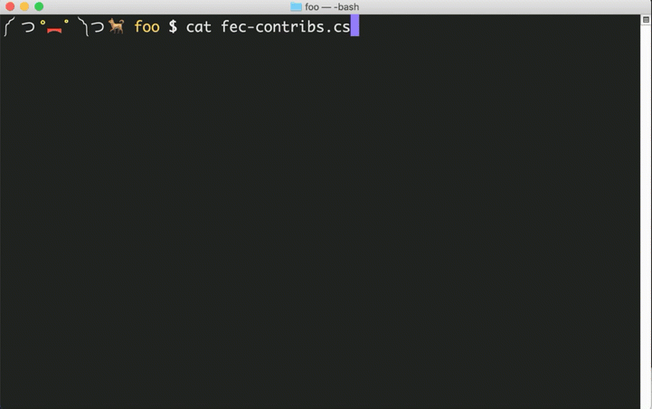

# Why learning to work with data from the command-line (e.g. csvkit/xsv) is the best thing you can do for yourself no matter how good/bad/overwhelmed you think you already are at Excel/SQL/RStudio/Jupyter/pandas ffs why do we learn all that fancy syntax and GUIs and encumber our soft delicate brains when we could be doing data work like they did it in the awesome 80s but with way less effort and much better looking laptops


This repo started out as a short guide comparing the extremely useful command-line tools, [BurntSushi/xsv](https://github.com/BurntSushi/xsv) and [wireservice/csvkit](https://github.com/wireservice/csvkit). But the writing quickly became a brain splurge of *"there are too many ways to talk about how these tools make exploring/wrangling/analyzing data so much easier"*, and *"boy all those times at NICAR/school/work when a little knowledge about the command-line and text files would've saved people hours of painful struggling"*. So I've decided I should make this repo bigger than a single README.md file, including creating a list of recipes and scenarios and packaged data in the [data/ dir](data/). 

Not much to see here, so here's a example of how, starting with the almost ~100,000 individual contributions to Senate campaigns in election week 2018, filter it to just money given by FAANG employees to the Texas race between Beto and Cruz:

```sh
cat fec-contribs.csv \
    | csvgrep -c committee_name -r 'BETO|CRUZ' \
    | csvgrep -c contributor_employer -r 'FACEBOOK|APPLE|AMAZON|NETFLIX|GOOGLE' \
    > senate-faangs.csv
```

Here's a GIF rendition of what that code looks like when typed in without coffee:



And here's a screenshot of what that looks like in Excel (see the [data file here](data/results/senate-faangs.csv)):


## Other resources

In the meantime, here are some various references and tutorials you can check out already:

- [The official csvkit tutorial](https://csvkit.readthedocs.io/en/latest/tutorial.html), which includes how to get things installed, how to try the commands, and even an example of how to use [csvkit as the "Excel killer"](https://csvkit.readthedocs.io/en/latest/tutorial/1_getting_started.html#in2csv-the-excel-killer)
- [Journocoder/educator Amanda Hickman has a csvkit tutorial](https://github.com/amandabee/workshops/wiki/Tutorial:-Using-CSVkit) among her many [data journalism workshop guides and tipsheets](https://github.com/amandabee/workshops/wiki).
- [Another csvkit tutorial/example from data journalist Daniela Q. Lépiz, aptly titled, "Too much data? Use the command-line"](http://code4sa.org/2016/08/02/too-much-data.html)
- [A csvkit workshop at NICAR18, by Christian McDonald of UT-Austin](https://github.com/utdata/csvkit-nicar2018)
- [A csvkit workshop at NICAR16, by data journalist Karrie Kehoe](https://github.com/KarrieK/NICAR16)
- ["Extracting and Working with CSV files"](https://www.compose.com/articles/comma-values-2-extracting-and-working-with-csv-files/) - a nice writeup by Dj Walker-Morgan in context of how csvkit can fit into the developer's workflow.
- [Eleven Awesome Things You Can Do with csvkit](https://source.opennews.org/articles/eleven-awesome-things-you-can-do-csvkit/) - A listicle of more advanced, esoteric data-wrangling techniques by csvkit's author, Christopher Groskopf
- [The slidedeck used by Groskopf and Anthony DeBarros when introducing csvkit to NICAR12](https://docs.google.com/presentation/d/16ngCYeN37gbiIxOKPHCyQ1i5foT-uwcKkVVIgeZlIAE/present?slide=id.i0) as "a suite of utilities for converting to and working with CSV, the king of tabular file formats"

I have a few Gists in which I've copied-pasted some crazy one-off scenarios to look at later. At the time, csvkit fit in perfectly as a nice hack before doing "actual" coding/engineering -- no guarantees if the gists make sense or even work (all of them refer to many other tools used in combination with csvkit):
    - [Fitting 2016 FEC campaign donor data into your humble spreadsheet](https://gist.github.com/dannguyen/b5e7639888115cc8c9ad6a1220ee1226)
    - [Importing FEC bulk data with bash and csvkit](https://gist.github.com/dannguyen/bbcce20fd62c44f960760bfb19ab837e)
    - [Use public data, t, and csvkit to find Congressmembers on Twitter from the command-line](https://gist.github.com/dannguyen/b815e66226955bf82a15) 
    - [How to download, import, and analyze San Francisco restaurant inspection data using SQLite3 and csvkit from the command-line.](https://gist.github.com/dannguyen/c9dd7afc4300ae8715d8)
    - [Using mdbtools to extract CSV data from the FAA Wildlife Strike database (.accdb, Microsoft Access)](https://gist.github.com/dannguyen/4caf05f4a27775e0a550cd0a4f3fa21f)
    - [Using the t and csvkit to quickly collect and analyze #nicar16 tweets from the command-line](https://gist.github.com/dannguyen/7c592c4559ee64f753e5)

